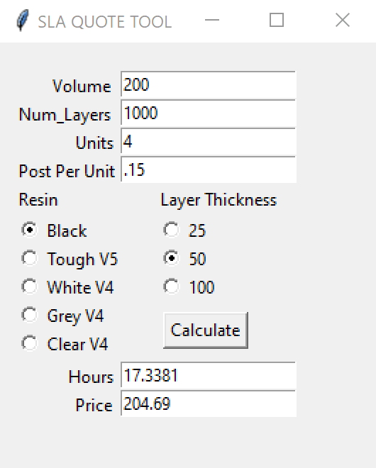

# SLA Quote Tool
Made a quote tool to speed up the print-time calculation using an ANN to predict print time for the Formlabs SLA Printer using different resins.

Also included code for generating an executable file using pyinstaller if desired.

 
<kbd>
  
</kbd>
